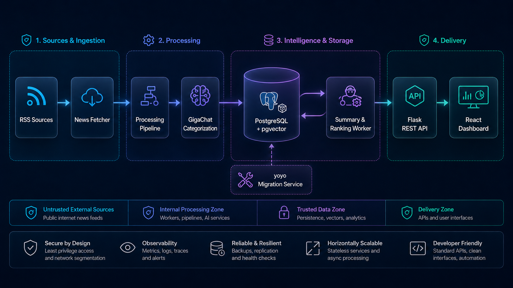

# HHack — AI News Intelligence Platform

[](https://www.python.org/)
[](https://github.com/pgvector/pgvector)
[](https://docs.docker.com/compose/)
[](https://developers.sber.ru/portal/products/gigachat-api)

HHack is an **AI-powered News Intelligence Platform** that continuously ingests RSS feeds, extracts and normalizes articles, enriches them with LLM-generated categories and summaries, and stores structured knowledge in PostgreSQL. The repository demonstrates a containerized backend and data-processing architecture designed for reproducible local deployment and incremental evolution.

## Overview

The platform turns heterogeneous news streams into queryable, enriched records. Independent services handle ingestion, AI processing, schema migrations, API access, and presentation, while Docker Compose provides one-command orchestration.

## Problem

Raw news feeds are high-volume, inconsistent, and difficult to analyze. Feed entries contain HTML, incomplete metadata, duplicate links, and no shared taxonomy. A useful intelligence layer must reliably collect this data, normalize it, add machine-readable context, and expose it without coupling ingestion to presentation.

## Solution

HHack implements a staged pipeline:

1. Poll configured RSS sources on a schedule.
2. Parse metadata and normalize article content.
3. Classify each article with GigaChat into a controlled taxonomy.
4. Persist unique articles in PostgreSQL.
5. Enrich pending records with summaries and relevance scores.
6. Serve the resulting knowledge base through a Flask API and React UI.

## Features

- Multi-source RSS ingestion and HTML normalization
- Scheduled article processing with per-source failure isolation
- LLM-based categorization and content enrichment
- Duplicate prevention through unique article links
- Structured PostgreSQL storage with pgvector-ready infrastructure
- Dedicated, repeatable yoyo migration service
- REST backend for news, sources, authentication, and health checks
- Containerized deployment with dependency-aware startup
- React dashboard for browsing the processed news stream

## Architecture



The diagram separates untrusted ingestion, internal processing, trusted storage, and delivery zones. Its lower capability strip represents the target production direction; health checks exist today, while full metrics, tracing, backups, and horizontal orchestration remain roadmap items. See [Architecture](docs/architecture.md) for service boundaries and deployment details.

## System Components

| Component | Responsibility |
| --- | --- |
| `news_parser` | Polls RSS sources, cleans content, invokes the category model, and writes idempotent article records. |
| `news_categorizer` | Processes unenriched records asynchronously, generating summaries and relevance scores. |
| `database_migrations` | Applies versioned yoyo migrations before application services start. |
| `postgres` | Stores normalized articles and enrichment results; pgvector enables a future semantic-search path. |
| `backend` | Exposes health, news, source, and authentication endpoints through Flask. |
| `frontend` | Presents the intelligence feed as a React/Vite application. |

## Data Flow

```text
Source → Fetch → Parse → Analyze → Store → Enrich → Query
```

The ingestion worker isolates source failures, the LLM acts only as an enrichment stage, and the database remains the system of record. A unique constraint on `news.link` makes repeated polling safe. More detail is available in [Data Flow](docs/data-flow.md).

## Engineering Decisions

- **Docker Compose** captures the complete local topology and startup dependencies in version-controlled configuration.
- **Separate services** keep ingestion, enrichment, migrations, API delivery, and UI concerns independently replaceable.
- **LLM as an enrichment layer** means source collection and structured storage do not depend on generative output being perfect.
- **Controlled category taxonomy** converts open-ended model output into predictable application data.
- **Pinned lock files and container images** make Python and Node dependency installation reproducible.
- **Migration-before-service startup** avoids runtime schema drift and makes database evolution explicit.

See [Engineering Decisions](docs/decisions.md) for trade-offs and current constraints.

## Tech Stack

| Area | Technologies |
| --- | --- |
| Backend | Python 3.13, Flask, SQLAlchemy, Pydantic |
| AI | GigaChat API, LangChain, LangGraph |
| Data ingestion | feedparser, Beautiful Soup, scheduled workers |
| Database | PostgreSQL, pgvector |
| Infrastructure | Docker, Docker Compose, Gunicorn |
| Migrations | yoyo-migrations |
| Frontend | React, TypeScript, Vite, TanStack Query |

## Local Development

### Prerequisites

- Git
- Docker Engine with Docker Compose v2
- GigaChat API credentials

### Quick start

```bash
git clone https://github.com/hoppa1231/HHack.git
cd HHack
cp .env.template .env
```

Set `GIGA_AUTH_KEY`, `GIGA_SCOPE`, and a non-default `SECRET_KEY` in `.env`, then start the stack:

```bash
docker compose up --build -d
docker compose ps
docker compose logs -f news_parser news_categorizer
```

Open the dashboard at `http://localhost:8080`. Verify the backend independently:

```bash
curl --fail http://localhost:5000/api/health
curl --fail 'http://localhost:5000/api/news?limit=5'
```

Expected health response:

```json
{"status":"ok"}
```

### Operational commands

Run migrations again:

```bash
docker compose run --rm database_migrations
```

Trigger a one-off ingestion container:

```bash
docker compose run --rm news_parser
```

Rebuild a single service after a code change:

```bash
docker compose up --build -d news_parser
```

Stop the stack while preserving database data:

```bash
docker compose down
```

Remove local database data only when a clean reset is intentional:

```bash
docker compose down --volumes
```

## Example Usage

Query recent technology articles:

```bash
curl --get http://localhost:5000/api/news \
  --data-urlencode 'category=технологии' \
  --data-urlencode 'limit=10'
```

Add an RSS source by extending `python_services/news_parser/src/lib/sources.py`, then rebuild `news_parser`.

## Demo

The local demo shows the complete path from RSS polling to an enriched article feed:

1. Start the Compose stack.
2. Follow `news_parser` logs to observe ingestion and categorization.
3. Open the dashboard and filter the resulting records.
4. Call `/api/news` to inspect the same structured data through the backend.

> **Screenshots placeholder:** add a sanitized dashboard capture at `docs/images/dashboard.png` and an ingestion-log capture at `docs/images/pipeline.png` before publishing a portfolio release.

## Repository Presentation

Suggested GitHub description:

> AI-powered news intelligence platform with automated RSS ingestion, LLM enrichment, PostgreSQL/pgvector storage, and a containerized Python backend.

Suggested topics: `news-intelligence`, `llm`, `data-engineering`, `python`, `postgresql`, `pgvector`, `docker-compose`, `rss`, `gigachat`, `react`.

## Future Roadmap

- Public, documented REST API with OpenAPI
- Embedding generation and pgvector semantic search
- Near-duplicate detection across publishers
- Explainable article ranking and personalization
- Pipeline metrics, tracing, retries, and dead-letter handling
- Analytics dashboard for topics, sources, and trends
- Automated tests and CI quality gates

## Documentation

- [Architecture](docs/architecture.md)
- [Data Flow](docs/data-flow.md)
- [Engineering Decisions](docs/decisions.md)
