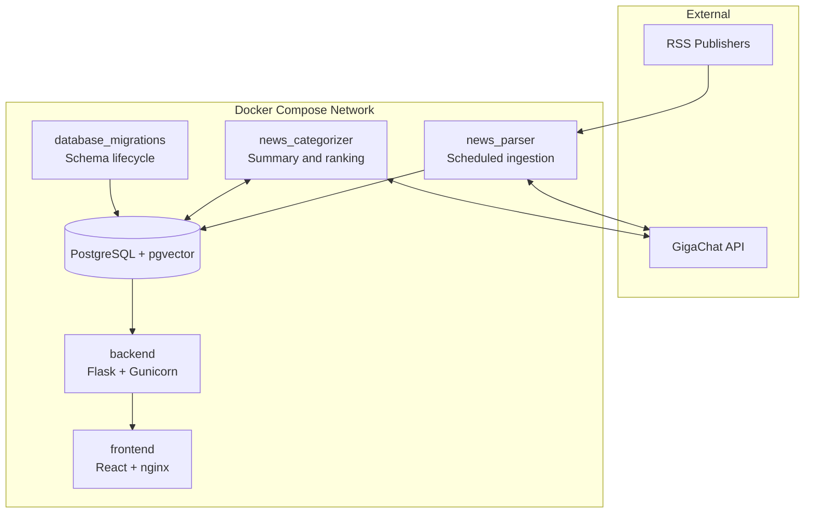

# System Architecture

HHack is a containerized news-intelligence system composed of independently deployable workers, a relational system of record, an HTTP backend, and a web client.

## Context

External RSS publishers provide unstructured feed entries. GigaChat supplies classification and enrichment capabilities. Users consume structured news through the backend API and React dashboard.

## Service boundaries

### Ingestion worker

`news_parser` owns source polling, feed parsing, HTML cleanup, initial AI categorization, and idempotent persistence. It does not expose a public API.

### Enrichment worker

`news_categorizer` reads records that have no generated summary, uses the AI/search graph to enrich them, calculates a relevance score, and writes the result back. This separates slower enrichment from feed acquisition.

### Database and migrations

PostgreSQL is the authoritative store. The pgvector image prepares the platform for embedding columns and similarity indexes. `database_migrations` is a one-shot yoyo service and must complete successfully before application containers start.

### API and presentation

The Flask backend maps stored records to validated response schemas and exposes health, news, source, registration, and login routes. The React frontend consumes that API; it has no direct database access.

## Runtime characteristics

- Compose health checks gate database-dependent startup.
- Each long-running worker catches per-cycle failures and continues processing.
- Unique article links provide ingestion idempotency.
- Environment variables inject credentials and connection details at runtime.
- Named volumes preserve PostgreSQL state across container replacement.

## Scaling path

The current design is appropriate for a single-node portfolio deployment. Horizontal growth would replace polling loops with a durable queue, partition workers by source or article ID, add connection pooling and observability, and run services under an orchestrator. The existing boundaries allow those changes without replacing the whole system.
