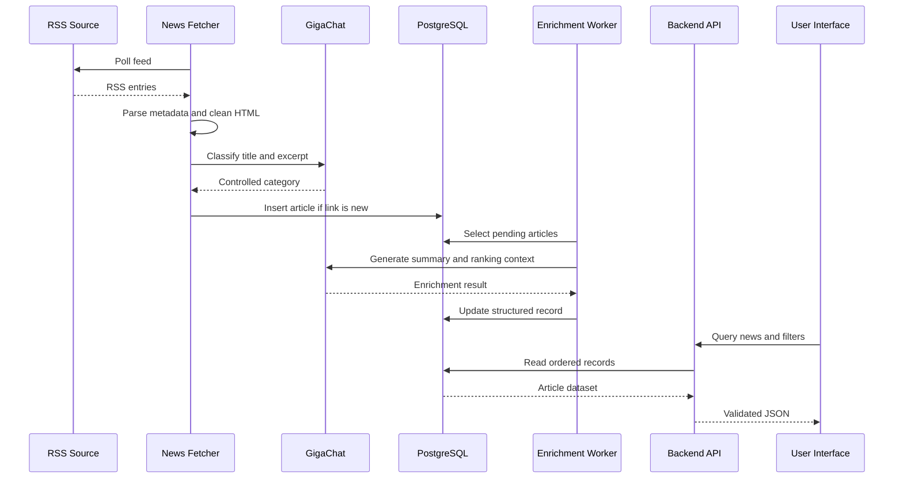

# Data Flow

The processing path is deliberately staged so ingestion, model calls, persistence, and delivery can evolve independently.

## Processing stages

1. **Source** — RSS endpoints are configured in code with a stable source name and URL.
2. **Fetch** — `feedparser` retrieves entries; one unavailable source does not terminate the whole cycle.
3. **Parse** — title, link, publication time, description, content, and image metadata are normalized.
4. **Analyze** — GigaChat maps the article to a controlled category. Invalid or unavailable output falls back to `другое`.
5. **Store** — SQLAlchemy inserts only unseen links into PostgreSQL in a transaction.
6. **Enrich** — a separate worker finds records without summaries, produces an AI summary and score, and updates them.
7. **Serve** — Flask applies filters and validated schemas before returning records to the frontend.

## Data integrity

- `news.link` is unique, making repeated RSS polling idempotent.
- Category values are constrained by the PostgreSQL enum.
- Writes are committed as transactions and rolled back on failure.
- Migration execution is serialized with a database lock.
- Credentials are supplied through environment variables and are not embedded in application code.

## Failure behavior

Source and article failures are logged with context. Database failures roll back the current transaction. Model errors degrade categorization to a known fallback instead of producing arbitrary taxonomy values. A production expansion should add bounded retries, timeouts, metrics, and a dead-letter queue.
